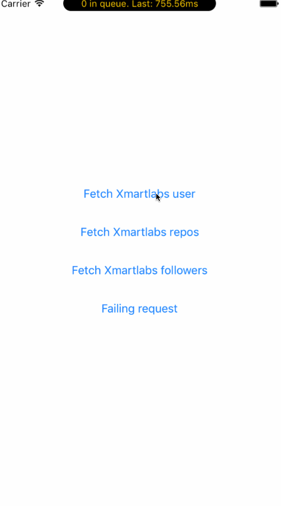
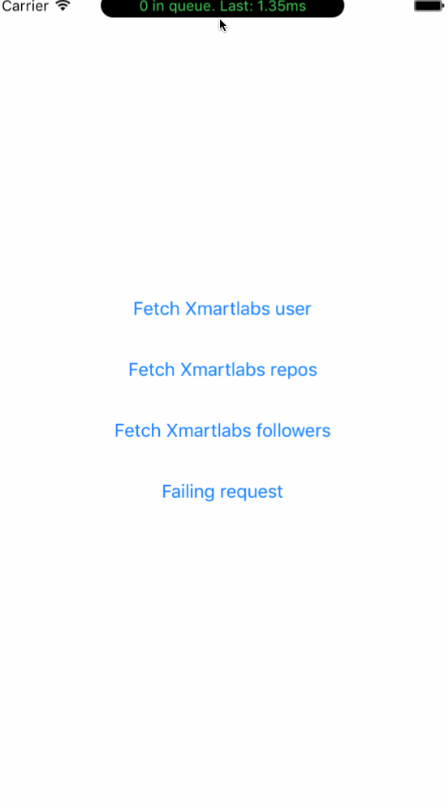

<p align="left">

<a href="https://developer.apple.com/swift"></a>
<a href="https://github.com/Carthage/Carthage"></a>
<a href="https://cocoapods.org/pods/Xniffer"></a>
<a href="https://raw.githubusercontent.com/xmartlabs/Xniffer/master/LICENSE"></a>
</p>

By [Xmartlabs SRL](http://xmartlabs.com).

## Introduction

Xniffer is a non-intrusive framework for intercepting outgoing requests and their responses between your app and any external service for debugging and performance monitoring purposes.

<a href="https://github.com/netguru/ResponseDetective"> Inspired by Response detective. </a>





## Setup

In order to work, the Xniffer needs to be added as a middleware between your URLSession and the Internet.
After the initial setup, a window will be displayed on top of the UI that will show all the current requests and their latency.

#### Basic usage
```swift

let configuration = URLSessionConfiguration.default
// The setup method adds the Xniffer's custom protocol as a middleware.
Xniffer.setup(with: configuration)
let session = URLSession(configuration: configuration)
```
Now we can start using this session instance for our requests!

#### Using Alamofire
If you are using Alamofire you can start using the Xniffer by initializing your Manager with the following:
```swift

let configuration = URLSessionConfiguration.default
configuration.httpAdditionalHeaders = SessionManager.defaultHTTPHeaders
Xniffer.setup(with: configuration)
let sessionManager = Alamofire.SessionManager(configuration: configuration)
```
### UI Modes
The Xniffer currently supports three modes, `.window`, `.console` and `.custom`. The default value is `.window` but this can be changed easily on the `Xniffer.setup(configuration: URLSessionConfiguration, mode: XnifferUI = .window)`.
 Each one of this uses a different implementation of the `XnifferDelegate`.

  * `.window` : Displays a window on top of the status bar which can be expanded to display a list of the profiled requests. This is the default value.
  * `.console` : Prints the results on the Xcode console.
  * `.custom` : This one receives a closure of type `() -> ()` so you can use your own implementation of the `XnifferDelegate`.


## Requirements

* iOS 9.0+
* Xcode 8.0+

## Getting involved

* If you **want to contribute** please feel free to **submit pull requests**.
* If you **have a feature request** please **open an issue**.
* If you **found a bug** or **need help** please **check older issues, [FAQ](#faq) and threads on [StackOverflow](http://stackoverflow.com/questions/tagged/Xniffer) (Tag 'Xniffer') before submitting an issue.**.

Before contribute check the [CONTRIBUTING](https://github.com/xmartlabs/Xniffer/blob/master/CONTRIBUTING.md) file for more info.

If you use **Xniffer** in your app We would love to hear about it! Drop us a line on [twitter](https://twitter.com/xmartlabs).

## Examples

Follow these 3 steps to run Example project: Clone Xniffer repository, open Xniffer workspace and run the *Example* project.
## Installation

#### CocoaPods

[CocoaPods](https://cocoapods.org/) is a dependency manager for Cocoa projects.

To install Xniffer, simply add the following line to your Podfile:

```ruby
pod 'Xniffer', '~> 1.0'
```

#### Carthage

[Carthage](https://github.com/Carthage/Carthage) is a simple, decentralized dependency manager for Cocoa.

To install Xniffer, simply add the following line to your Cartfile:

```ogdl
github "xmartlabs/Xniffer" ~> 1.0
```

## Author

* [Mauricio Cousillas](https://github.com/mcousillas6)

# Change Log

This can be found in the [CHANGELOG.md](CHANGELOG.md) file.
